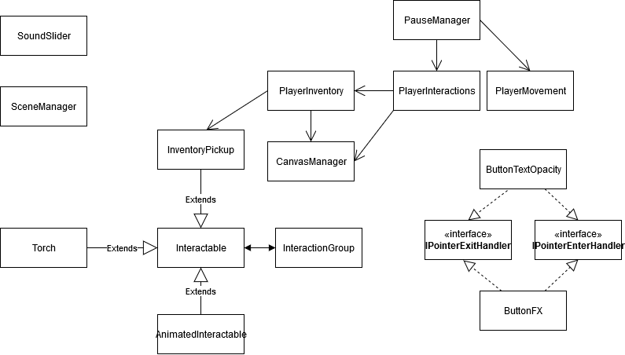

# Sheoul
## Projeto realizado no âmbito da disciplina de Desenvolvimento de Jogos Digitais II

---
## Autoria

- Hugo Feliciano, nº2180
  - Sistemas de _UI_ e Menus.
  - Código de movimento e interação jogador-ambiente.
  - Programação de Som

- Pedro Fernandes, nº21803791
  - Design de Puzzles, aplicação dos mesmos utilizando o sistema de _Interaction Groups_.
  - _Level Design_ e construção do seu _Layout_.
  - Código de _UI_.
  - Grafico UML.

- Rafael Castro e Silva, nº21903059
  - Sistemas de particulas e configuração de luz.
  - Sistema de _Interaction Groups_ e lógica dos objetos _Interactable_.
  - Refactoring de código original do protótipo.

[Link para o repositório e branch em uso.](https://github.com/QuadQuasimodo/Sheoul_VerticalSlice/tree/Old-State)

### Arquitetura da Solução

- Foi criado um sistema de grupos de interagiveis. Existe uma classe _Interactable_ de onde todos os objetos que podem pertencer a este grupo herdam. 
- Um _Interactable Group_ tem várias propriedades e opções no que toca a como os seus constituintes devem agir quando ativados. A variadade de combinação de opções e tipos de objetos concretos que podem ser usados nestes grupos permitem que vários puzzles tenham sido feitos utilizando o inspetor do _Unity_ com uma lógica consistente.
- Como exemplo de grupos, temos uma Chave e uma Porta, um conjunto de tochas que se acendem todas quando o jogador interage apenas com uma e uma ponte gigante que cái aos pés do jogador quando este acende um numero de tochas.
- Foram usados sistemas de particulas para o fogo, usufruindo do sistema de _prefabs_ e _prefab variants_ do _Unity_.
- Para o sistema de inventário usámos uma _List_ que guarda _InventoryPickups_, estes guardam uma referencia para os icones respetivos usados para os representar na _hotbar_ no fundo do ecrâ.
  
### UML

---

## Referências

- Utilização de código disponibilizado pelo tutor da disciplina de Desenvolvimento de Jogos
  Digitais II, Nélio Codices, para a realização do exercício.

- Utilização e adaptação do pacote de assets "Greek Low Poly Pack - Lite" disponível na 
  Unity Asset Store